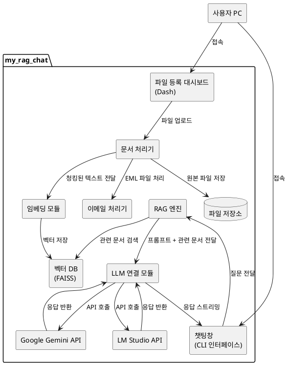
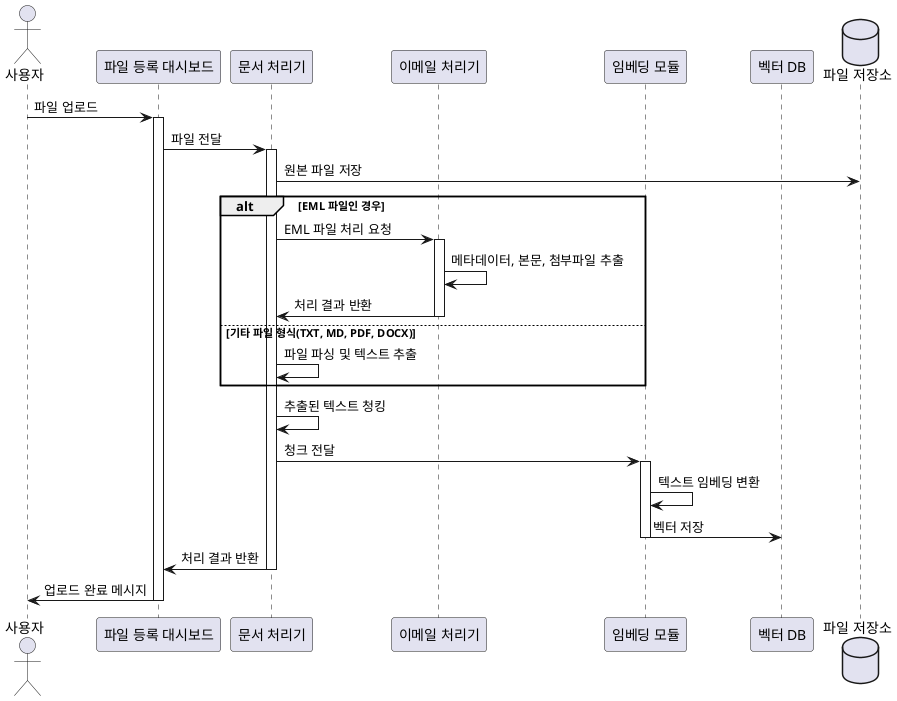
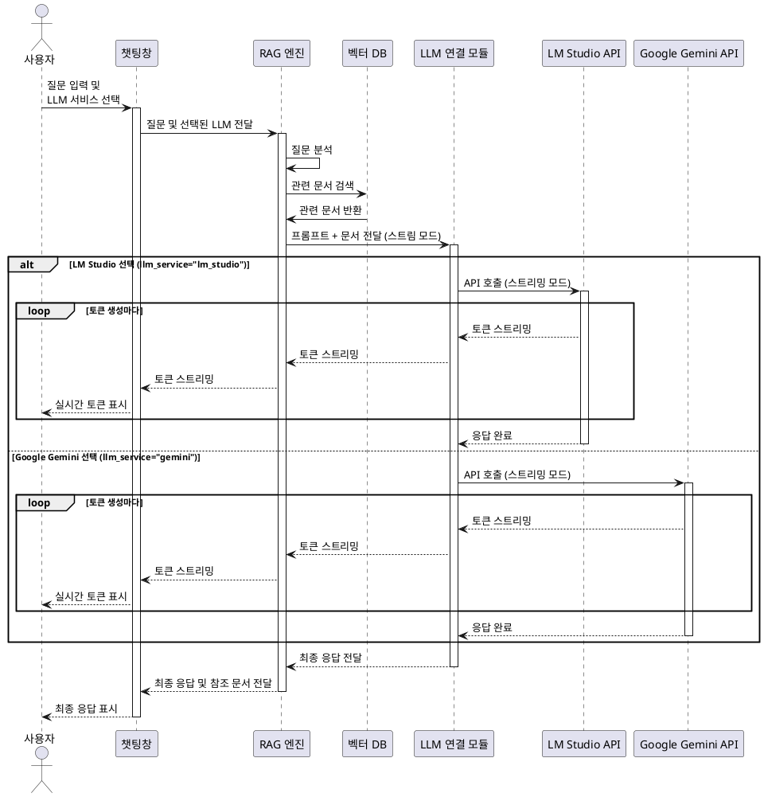
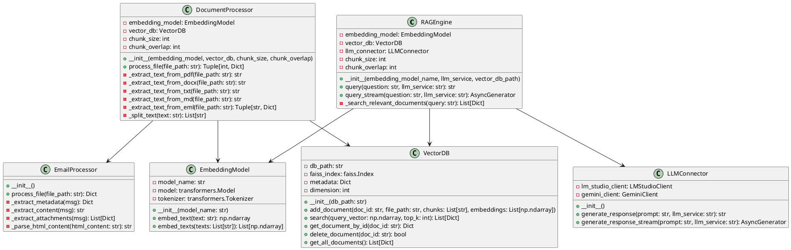

# RAG 기반 개인용 생성형 AI 챗봇 - 아키텍처 설계서

## 1. 개요
본 문서는 "RAG 기반 개인용 생성형 AI 챗봇" 시스템의 아키텍처를 정의합니다. 이 시스템은 사용자가 개인 PC에 저장된 문서를 업로드하고, 해당 문서를 기반으로 질의응답을 수행할 수 있는 챗봇 서비스를 제공합니다.

## 2. 시스템 아키텍처

### 2.1 전체 아키텍처

### 2.2 주요 컴포넌트

#### 2.2.1 파일 등록 대시보드 (Dash)
- Dash 프레임워크를 사용하여 구현된 웹 인터페이스
- 사용자가 문서 파일을 업로드하고 관리할 수 있는 UI 제공
- 파일 업로드, 목록 조회, 삭제 기능 제공
- TXT, MD, PDF, DOCX, EML 파일 형식 지원

#### 2.2.2 문서 처리기
- 다양한 형식의 문서(txt, md, pdf, docx, eml)를 처리하는 모듈
- 문서 파싱, 청킹, 전처리 수행
- 한글 파일명 처리 및 인코딩 처리
- 이메일(eml) 파일 처리를 위해 이메일 처리기 모듈과 연동

#### 2.2.3 이메일 처리기
- EML 파일에서 메타데이터(제목, 발신자, 수신자, 날짜) 추출
- 이메일 본문 텍스트 추출 (plain text 및 HTML 형식 모두 지원)
- 첨부 파일 정보 추출 및 처리
- beautifulsoup4 라이브러리를 활용한 HTML 컨텐츠 파싱

#### 2.2.4 임베딩 모듈
- jhgan/ko-sroberta-multitask 모델을 사용한 텍스트 임베딩
- 문서 청크를 벡터로 변환하는 기능 제공
- 다국어(특히 한글) 텍스트 처리 최적화

#### 2.2.5 벡터 DB (FAISS)
- 문서 벡터를 저장하고 검색하는 벡터 데이터베이스
- 유사도 검색 기능 제공
- 메타데이터 저장 및 관리

#### 2.2.6 RAG 엔진
- 사용자 질문을 분석하여 관련 문서 검색
- 검색된 문서와 사용자 질문을 결합하여 LLM 프롬프트 생성
- 스트리밍 및 일반 모드로 응답을 처리하는 기능 제공
- 다양한 LLM 서비스(lm_studio, gemini) 선택 및 연결 지원

#### 2.2.7 LLM 연결 모듈
- LM Studio API와 Google Gemini API를 통합하는 모듈
- llm_service 매개변수를 통한 LLM 서비스 선택 기능
- 프롬프트 전송 및 응답 수신 처리
- 스트리밍 모드 지원 (실시간 토큰 단위 응답 처리)
- 다양한 LLM 제공자 지원을 위한 인터페이스 제공

#### 2.2.8 챗팅창 (CLI 인터페이스)
- 명령줄 기반 대화형 인터페이스
- 사용자 질문 입력 및 응답 표시
- 대화 내역 관리 및 새 대화 시작 기능
- LLM 서비스 선택 기능 제공

## 3. 기능적 설계

### 3.1 파일 등록 및 처리 프로세스

### 3.2 질의응답 프로세스

## 4. 데이터 설계

### 4.1 벡터 DB 구조
- FAISS 인덱스 파일: 문서 벡터 저장
- 메타데이터 파일: JSON 형식으로 문서 정보 저장
  - 문서 ID
  - 파일 경로
  - 파일명
  - 파일 형식
  - 생성/수정 일시
  - 청크 정보 (인덱스, 내용)
  - 이메일 특수 메타데이터 (제목, 발신자, 수신자, 날짜, 첨부파일 정보)

### 4.2 주요 클래스 다이어그램

## 5. 비기능적 설계

### 5.1 성능 최적화
- 청킹 사이즈 최적화: 512~1024 토큰 범위 내에서 설정
- 벡터 검색 최적화: FAISS 인덱스 타입 선택 (Flat 인덱스 사용)
- 비동기 처리: 파일 업로드 및 처리 과정에서 비동기 처리 적용
- 이메일 파일 처리 최적화: 메타데이터 및 본문 추출 로직 분리

### 5.2 확장성 설계
- 플러그인 아키텍처: 새로운 문서 형식 지원을 위한 추출기 인터페이스
- LLM 서비스 추상화: 다양한 LLM API를 쉽게 통합할 수 있는 인터페이스
- 구성 설정: 환경 변수 및 구성 파일을 통한 시스템 파라미터 조정 가능
- 임베딩 모델 교체 가능: 다양한 임베딩 모델 지원 인터페이스

### 5.3 에러 처리 및 로깅
- 구조화된 로깅: 모든 모듈에서 일관된 로깅 체계 적용
- 예외 처리: 주요 오류 지점에 대한 명확한 예외 처리 및 사용자 피드백
- 복구 메커니즘: 파일 처리 실패 시 부분 복구 지원
- 로그 레벨 조정: 개발 및 운영 환경에 따른 로그 상세도 조정 가능

### 5.4 보안 설계
- API 키 관리: 환경 변수를 통한 안전한 API 키 관리
- 로컬 처리: 사용자 데이터는 로컬에서만 처리
- 파일 접근 제한: 필요한 파일에만 접근 권한 부여

## 6. 배포 및 설치 설계
- 가상 환경: Miniconda 환경 설정 스크립트 제공
- 패키지 의존성: requirements.txt를 통한 명확한 패키지 버전 관리
- 설치 가이드: 초보자도 따라할 수 있는 상세한 설치 가이드 제공
- 설정 파일: 주요 설정을 변경할 수 있는 구성 파일 제공

## 7. 기술적 의사 결정

### 7.1. LLM 서비스 선택 근거
- LM Studio: 로컬 환경에서 다양한 오픈소스 모델 지원, 인터넷 연결 없이 사용 가능
- Google Gemini: 높은 품질의 응답, 다국어 지원 우수, API 사용의 편의성

### 7.2. 벡터 DB 선택 근거
- FAISS: 고성능 벡터 검색, CPU에서도 효율적 동작, 메모리 사용 최적화

### 7.3. 임베딩 모델 선택 근거
- jhgan/ko-sroberta-multitask: 한국어 지원 우수, 상대적으로 가벼운 모델 크기, 다목적 임베딩 성능

### 7.4. 파일 지원 형식 선택 근거
- TXT, MD: 텍스트 기반 포맷으로 처리 용이
- PDF, DOCX: 가장 일반적인 문서 형식
- EML: 이메일 데이터 포함 필요성
