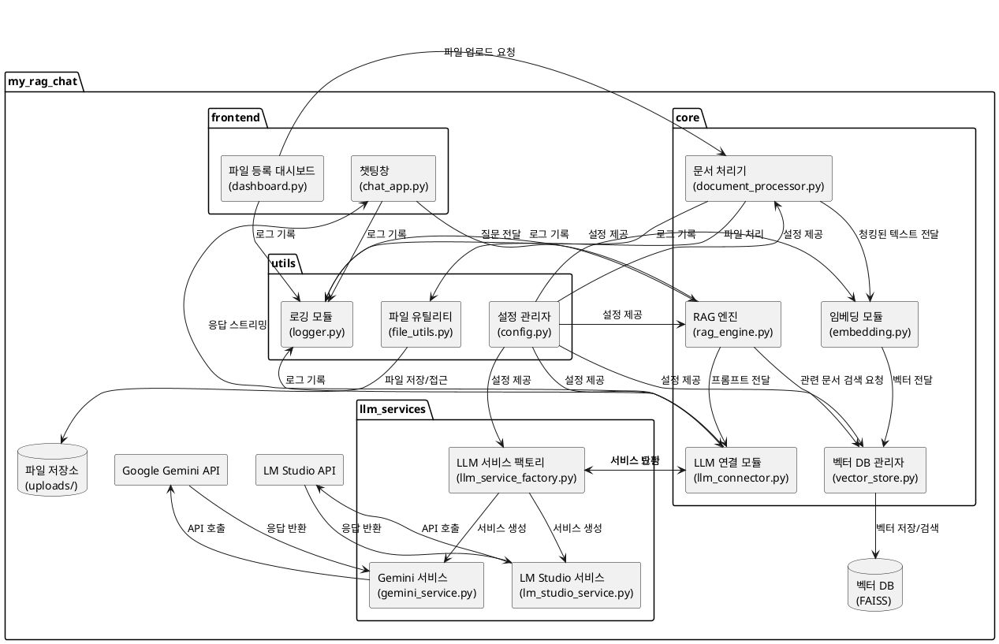
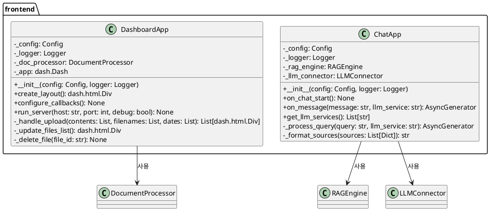
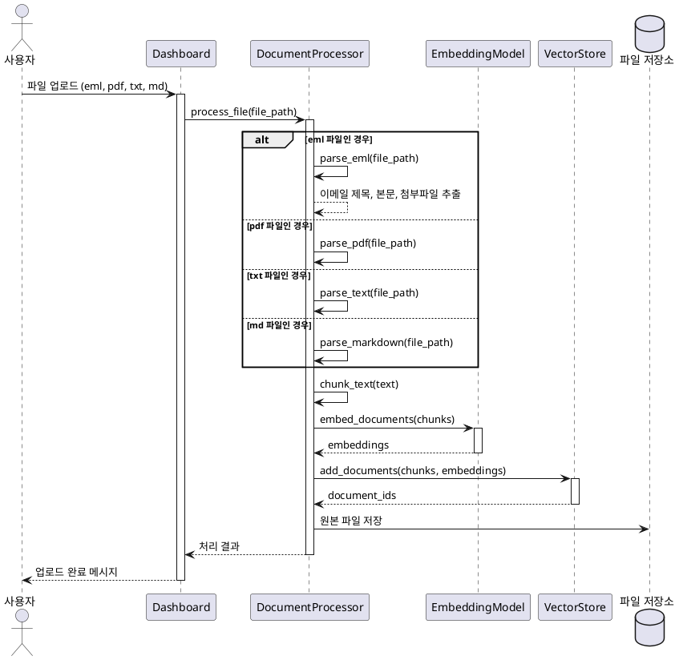
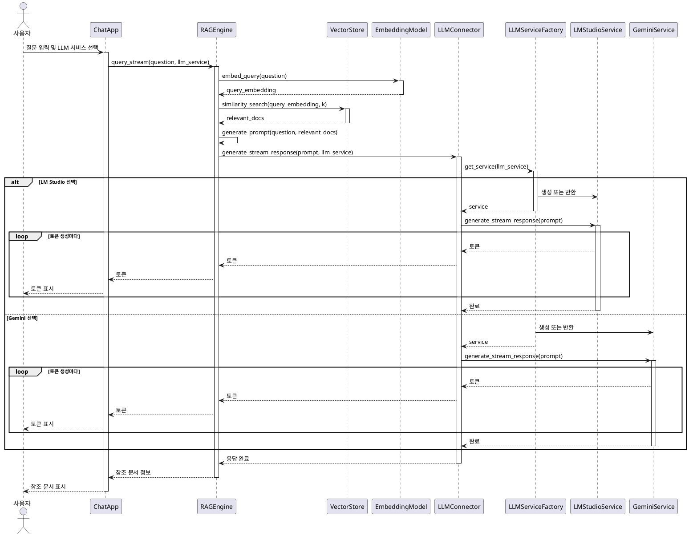

# RAG 기반 개인용 생성형 AI 챗봇 - 상세 설계서

## 1. 개요
본 문서는 "RAG 기반 개인용 생성형 AI 챗봇" 시스템의 상세 설계 내용을 정의합니다. 컴포넌트 다이어그램, 클래스 다이어그램, 시퀀스 다이어그램을 포함하여 시스템의 구조와 동작을 상세하게 설명합니다.

## 2. 컴포넌트 다이어그램

### 2.1 전체 시스템 컴포넌트 다이어그램



## 3. 클래스 다이어그램

### 3.1 코어 모듈 클래스 다이어그램

```plantuml
@startuml
skinparam backgroundColor white
skinparam classAttributeIconSize 0

package "core" {
  class DocumentProcessor {
    - _config: Config
    - _logger: Logger
    - _embedding: EmbeddingModel
    - _vector_store: VectorStore
    + __init__(config: Config, logger: Logger)
    + process_file(file_path: str): bool
    + chunk_text(text: str, chunk_size: int, overlap: int): List[str]
    + parse_pdf(file_path: str): str
    + parse_text(file_path: str): str
    + parse_markdown(file_path: str): str
    + parse_eml(file_path: str): str
    + delete_file(file_id: str): bool
    + get_files_list(): List[Dict]
  }
  
  class EmbeddingModel {
    - _model_name: str
    - _model: HuggingFaceModel
    - _device: str
    - _logger: Logger
    + __init__(config: Config, logger: Logger)
    + embed_text(text: str): np.ndarray
    + embed_documents(documents: List[str]): List[np.ndarray]
    + get_embedding_dimension(): int
  }
  
  class VectorStore {
    - _index_path: str
    - _index: faiss.Index
    - _documents: List[Dict]
    - _logger: Logger
    + __init__(config: Config, logger: Logger)
    + add_documents(documents: List[Dict], embeddings: List[np.ndarray]): List[str]
    + similarity_search(query_embedding: np.ndarray, k: int): List[Dict]
    + save_index(): bool
    + load_index(): bool
    + delete_document(doc_id: str): bool
    + get_document(doc_id: str): Dict
  }
  
  class RAGEngine {
    - _config: Config
    - _vector_store: VectorStore
    - _embedding_model: EmbeddingModel
    - _logger: Logger
    + __init__(config: Config, logger: Logger)
    + query(question: str, k: int): Tuple[str, List[Dict]]
    + generate_prompt(question: str, contexts: List[Dict]): str
    + format_context(contexts: List[Dict]): str
    + query_stream(question: str, k: int, llm_service: str): Generator
  }
  
  class LLMConnector {
    - _config: Config
    - _logger: Logger
    - _llm_service_factory: LLMServiceFactory
    + __init__(config: Config, logger: Logger)
    + generate_response(prompt: str, llm_service: str): AsyncGenerator[str, None]
    + is_api_available(llm_service: str): bool
    + get_model_info(llm_service: str): Dict
    + generate_stream_response(prompt: str, llm_service: str): Generator
  }
}

package "llm_services" {
  interface ILLMService {
    + generate_response(prompt: str): str
    + generate_stream_response(prompt: str): Generator
    + is_available(): bool
    + get_model_info(): Dict
  }
  
  class LMStudioService {
    - _api_base_url: str
    - _api_key: str
    - _logger: Logger
    + __init__(config: Config, logger: Logger)
    + generate_response(prompt: str): str
    + generate_stream_response(prompt: str): Generator
    + is_available(): bool
    + get_model_info(): Dict
  }
  
  class GeminiService {
    - _api_key: str
    - _logger: Logger
    + __init__(config: Config, logger: Logger)
    + generate_response(prompt: str): str
    + generate_stream_response(prompt: str): Generator
    + is_available(): bool
    + get_model_info(): Dict
  }
  
  class LLMServiceFactory {
    - _config: Config
    - _logger: Logger
    - _services: Dict[str, ILLMService]
    + __init__(config: Config, logger: Logger)
    + get_service(service_name: str): ILLMService
    + register_service(service_name: str, service: ILLMService): None
    + list_available_services(): List[str]
  }
  
  LMStudioService ..|> ILLMService
  GeminiService ..|> ILLMService
  LLMServiceFactory --> ILLMService
}

package "utils" {
  class Config {
    - _config_path: str
    - _config_data: Dict
    + __init__(config_path: str)
    + get(key: str, default=None): Any
    + set(key: str, value: Any): None
    + save(): None
    + load(): None
  }
  
  class Logger {
    - _log_file: str
    - _log_level: str
    + __init__(config: Config)
    + info(message: str): None
    + error(message: str): None
    + warning(message: str): None
    + debug(message: str): None
  }
  
  class FileUtils {
    + {static} save_uploaded_file(file: UploadFile, upload_dir: str): str
    + {static} get_file_extension(filename: str): str
    + {static} is_supported_extension(extension: str, supported_types: List[str]): bool
    + {static} normalize_filename(filename: str): str
    + {static} get_file_size(file_path: str): int
    + {static} delete_file(file_path: str): bool
    + {static} get_files_list(directory: str): List[Dict]
  }
}

' 관계 정의
DocumentProcessor --> EmbeddingModel : 사용
DocumentProcessor --> VectorStore : 사용
DocumentProcessor --> FileUtils : 사용
RAGEngine --> EmbeddingModel : 사용
RAGEngine --> VectorStore : 사용
DocumentProcessor --> Logger : 사용
RAGEngine --> Logger : 사용
LLMConnector --> Logger : 사용
LLMConnector --> LLMServiceFactory : 사용
@enduml
```



### 3.2 프론트엔드 모듈 클래스 다이어그램



## 4. 시퀀스 다이어그램

### 4.1 파일 업로드 및 처리 시퀀스



### 4.2 질의응답 시퀀스



## 5. 컴포넌트 상세 설계

### 5.1 문서 처리기 (document_processor.py)
- **주요 기능**:
  - 다양한 문서 형식(txt, md, pdf, eml) 처리
  - 문서 청킹
  - 처리된 문서의 임베딩 및 벡터 DB 저장
- **주요 메소드**:
  - `process_file`: 파일 처리 메인 메소드
  - `parse_pdf`, `parse_text`, `parse_markdown`, `parse_eml`: 각 파일 형식별 파싱 메소드
  - `chunk_text`: 텍스트 청킹 메소드
  - `get_files_list`: 처리된 파일 목록 반환
- **핵심 구현 내용**:
  - EML 파일 처리: 이메일 헤더(From, To, Subject), 본문, 첨부 파일 텍스트 추출
  - 한글 인코딩 처리: UTF-8, EUC-KR, CP949 등 다양한 인코딩 지원
  - 첨부 파일 내용 추출: 텍스트 기반 첨부 파일의 내용 추출 및 포함

### 5.2 LLM 서비스 모듈
- **주요 구성 요소**:
  - `ILLMService`: LLM 서비스 인터페이스
  - `LMStudioService`: LM Studio API 구현
  - `GeminiService`: Google Gemini API 구현
  - `LLMServiceFactory`: 서비스 생성 및 관리 팩토리 클래스
- **핵심 기능**:
  - 스트리밍 응답 처리: 실시간 토큰 단위 응답 처리
  - 다양한 LLM 서비스 통합: 공통 인터페이스를 통한 다양한 LLM 서비스 통합
  - 서비스 상태 확인: API 사용 가능 여부 확인
- **GeminiService 구현 내용**:
  - Google Gemini API 연동
  - 스트리밍 모드 지원
  - 프롬프트 형식 최적화

### 5.3 LLM 연결 모듈 (llm_connector.py)
- **주요 기능**:
  - LLM 서비스 팩토리를 통한 다양한 LLM 서비스 관리
  - 프롬프트 전송 및 응답 수신
  - 스트리밍 모드 지원
- **주요 메소드**:
  - `generate_response`: 일반 응답 생성
  - `generate_stream_response`: 스트리밍 응답 생성
  - `is_api_available`: API 사용 가능 여부 확인
- **핵심 구현 내용**:
  - 팩토리 패턴을 통한 LLM 서비스 추상화
  - 서비스별 적절한 프롬프트 형식 변환
  - 에러 처리 및 재시도 로직

### 5.4 RAG 엔진 (rag_engine.py)
- **주요 기능**:
  - 사용자 질문 분석
  - 관련 문서 검색
  - LLM 프롬프트 생성
- **주요 메소드**:
  - `query`: 일반 질의응답
  - `query_stream`: 스트리밍 질의응답
  - `generate_prompt`: 프롬프트 생성
- **핵심 구현 내용**:
  - 선택된 LLM 서비스에 따른 처리 분기
  - 문서 검색 결과 포맷팅
  - LLM 서비스별 최적화된 프롬프트 형식 사용

### 5.5 챗팅창 (chat_app.py)
- **주요 기능**:
  - 사용자 질문 입력 및 LLM 서비스 선택 UI 제공
  - 질문 처리 및 응답 표시
  - 대화 내역 관리
- **주요 메소드**:
  - `on_chat_start`: 채팅 세션 초기화
  - `on_message`: 메시지 처리
  - `get_llm_services`: 사용 가능한 LLM 서비스 목록 반환
- **핵심 구현 내용**:
  - LLM 서비스 선택 드롭다운 UI 구현
  - 스트리밍 응답 실시간 표시
  - 참조 문서 표시

## 6. 핵심 기능 구현 상세

### 6.1 EML 파일 처리
- **이메일 파싱**: `email` 패키지를 사용하여 이메일 파일 구조 파싱
- **주요 구현 내용**:
  - 이메일 헤더 정보(발신자, 수신자, 제목, 날짜) 추출
  - 텍스트 및 HTML 본문 추출 및 HTML 태그 제거
  - MIME 다중 파트 처리
  - 첨부 파일 내용 추출(텍스트 기반 첨부 파일)
  - 인코딩 처리 (Base64, Quoted-Printable 등)
  - 지원되는 첨부 파일 형식: txt, md, pdf 등
- **메타데이터 구성**:
  - 이메일 제목, 발신자, 수신자, 날짜를 메타데이터로 저장
  - 첨부 파일 정보 메타데이터 포함

### 6.2 Google Gemini API 통합
- **Gemini API 인터페이스**:
  - `google.generativeai` 패키지를 사용하여 Gemini API 통합
  - API 키 환경 변수에서 로드 (`GEMINI_API_KEY`)
- **스트리밍 구현**:
  - 스트리밍 모드로 응답 생성 및 처리
  - 응답 청크를 실시간으로 UI에 전달
- **프롬프트 최적화**:
  - Gemini 모델에 최적화된 프롬프트 형식 사용
  - 컨텍스트 길이 제한 처리
- **에러 처리**:
  - API 요청 실패 시 재시도 로직
  - 모델 제한 사항(rate limit, token limit 등) 처리

### 6.3 LLM 서비스 추상화 및 팩토리 패턴
- **인터페이스 설계**:
  - `ILLMService` 인터페이스를 통한 공통 API 정의
  - 모든 LLM 서비스 구현체는 동일한 인터페이스 준수
- **팩토리 패턴 구현**:
  - `LLMServiceFactory`를 통한 서비스 인스턴스 생성 및 관리
  - 서비스 등록 및 조회 기능
- **설정 관리**:
  - API 키 및 엔드포인트 설정을 config 모듈에서 관리
  - 환경 변수 및 구성 파일을 통한 설정 제공
- **예외 처리**:
  - 서비스 가용성 확인
  - 적절한 에러 메시지 및 폴백 처리

### 6.4 Chainlit UI 확장
- **LLM 서비스 선택 UI**:
  - 사용자가 대화 시작 또는 중간에 LLM 서비스 선택 가능
  - 드롭다운 메뉴로 사용 가능한 서비스 목록 표시
- **설정 관리**:
  - API 키 설정 UI (환경 변수 설정으로 대체 가능)
  - 서비스별 파라미터 설정 (온도, 최대 토큰 수 등)
- **응답 표시 최적화**:
  - 스트리밍 응답 표시 개선
  - 서비스별 응답 포맷팅

### 6.5 문서 청킹 및 벡터 DB 저장
- **청킹 전략**:
  - 의미 단위 청킹 (문단, 문장 등)
  - 겹침(Overlap) 적용으로 문맥 연속성 보장
- **메타데이터 관리**:
  - 문서 유형별 적절한 메타데이터 구성
  - 이메일의 경우 발신자, 수신자, 제목, 날짜 포함
- **벡터 DB 인덱싱**:
  - FAISS를 사용한 효율적인 벡터 검색
  - 정기적인 인덱스 백업

## 7. 데이터 흐름

### 7.1 EML 파일 처리 흐름
```
사용자 업로드 → 파일 형식 확인 → EML 파싱 → 헤더 추출 → 본문 추출 → 첨부 파일 처리
→ 메타데이터 구성 → 텍스트 청킹 → 임베딩 생성 → 벡터 DB 저장
```

### 7.2 Gemini API 사용 흐름
```
사용자 질문 → LLM 서비스 선택 → 관련 문서 검색 → 프롬프트 생성 → Gemini 서비스 인스턴스 획득
→ Gemini API 호출(스트리밍) → 토큰 수신 → UI 표시 → 참조 문서 정보 표시
```
