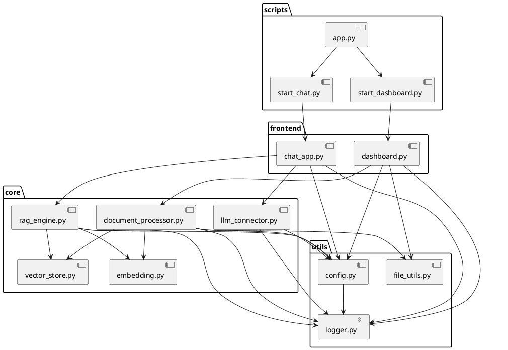
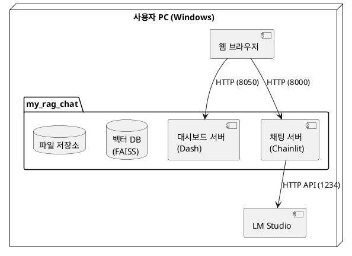

# RAG 기반 개인용 생성형 AI 챗봇 - 프로젝트 구조 설계

## 1. 프로젝트 디렉토리 구조

```
my_rag_chat/
│
├── config/
│   ├── config.yaml          # 설정 파일
│   └── logging_config.yaml  # 로깅 설정 파일
│
├── core/
│   ├── __init__.py
│   ├── document_processor.py  # 문서 처리 모듈
│   ├── embedding.py           # 임베딩 모듈
│   ├── llm_connector.py       # LLM 연결 모듈
│   ├── rag_engine.py          # RAG 엔진
│   └── vector_store.py        # 벡터 DB 관리 모듈
│
├── frontend/
│   ├── __init__.py
│   ├── assets/               # 정적 파일 (CSS, JS, 이미지)
│   │   ├── styles.css
│   │   └── favicon.ico
│   ├── chat_app.py           # Chainlit 채팅 앱
│   └── dashboard.py          # Dash 파일 관리 대시보드
│
├── utils/
│   ├── __init__.py
│   ├── config.py             # 설정 관리 유틸리티
│   ├── file_utils.py         # 파일 처리 유틸리티
│   └── logger.py             # 로깅 유틸리티
│
├── data/
│   ├── uploads/              # 업로드된 원본 파일 저장소
│   └── vector_db/            # 벡터 DB 저장소
│
├── logs/                     # 로그 파일 디렉토리
│   └── app.log
│
├── tests/                    # 테스트 코드
│   ├── __init__.py
│   ├── test_document_processor.py
│   ├── test_embedding.py
│   ├── test_rag_engine.py
│   ├── test_vector_store.py
│   └── test_llm_connector.py
│
├── docs/                     # 문서화
│   ├── 01_요구사항_정의서.md
│   ├── 02_아키텍처_설계서.md
│   ├── 03_상세_설계서.md
│   ├── 04_프로젝트_구조_설계.md
│   ├── 05_테스트_전략.md
│   └── 06_사용자_가이드.md
│
├── app.py                    # 애플리케이션 진입점
├── start_dashboard.py        # 대시보드 서버 실행 스크립트
├── start_chat.py             # 채팅 서버 실행 스크립트
├── setup.py                  # 패키지 설치 스크립트
├── README.md                 # 프로젝트 README
└── requirements.txt          # 의존성 패키지 목록
```

## 2. 주요 파일 설명

### 2.1 설정 파일

#### config/config.yaml
```yaml
# 시스템 설정
app_name: "내 RAG 챗봇"
debug_mode: true

# 서버 설정
dashboard:
  host: "localhost"
  port: 8050
chat:
  host: "localhost"
  port: 8000

# 파일 처리 설정
file:
  upload_dir: "data/uploads"
  supported_extensions: ["txt", "md", "pdf"]
  max_file_size: 10485760  # 10MB

# 청킹 설정
chunking:
  chunk_size: 512
  chunk_overlap: 50

# 임베딩 설정
embedding:
  model: "scottsuk0306/bge-m3-ko-v1.1"
  device: "cpu"

# 벡터 DB 설정
vector_db:
  path: "data/vector_db"
  similarity_top_k: 3

# LLM 설정
llm:
  api_base_url: "http://localhost:1234/v1"
  api_key: ""  # LM Studio는 일반적으로 API 키 불필요
  model: "LM Studio 모델"
  temperature: 0.7
  max_tokens: 2048
  stream: true
```

#### config/logging_config.yaml
```yaml
version: 1
formatters:
  standard:
    format: '%(asctime)s - %(name)s - %(levelname)s - %(message)s'
handlers:
  console:
    class: logging.StreamHandler
    level: INFO
    formatter: standard
    stream: ext://sys.stdout
  file:
    class: logging.FileHandler
    level: DEBUG
    formatter: standard
    filename: logs/app.log
    encoding: utf-8
loggers:
  my_rag_chat:
    level: DEBUG
    handlers: [console, file]
    propagate: false
root:
  level: INFO
  handlers: [console, file]
  propagate: false
```

### 2.2 핵심 모듈

#### core/document_processor.py
문서 처리 모듈로, 파일 파싱, 청킹, 임베딩 등을 처리합니다.

#### core/embedding.py
텍스트 임베딩을 처리하는 모듈로, Hugging Face 모델을 활용합니다.

#### core/vector_store.py
FAISS 벡터 DB를 관리하는 모듈입니다.

#### core/rag_engine.py
RAG 검색 및 프롬프트 생성을 담당하는 모듈입니다.

#### core/llm_connector.py
LM Studio API와의 통신을 담당하는 모듈입니다.

### 2.3 프론트엔드 모듈

#### frontend/dashboard.py
Dash 기반의 파일 업로드 및 관리 대시보드입니다.

#### frontend/chat_app.py
Chainlit 기반의 채팅 인터페이스입니다.

### 2.4 유틸리티 모듈

#### utils/config.py
설정 파일을 로드하고 관리하는 유틸리티입니다.

#### utils/file_utils.py
파일 처리와 관련된 유틸리티 함수들을 제공합니다.

#### utils/logger.py
로깅 설정 및 로거 인스턴스를 제공합니다.

### 2.5 진입점 스크립트

#### app.py
전체 애플리케이션의 진입점으로, 대시보드와 채팅 서버를 동시에 실행할 수 있습니다.

#### start_dashboard.py
대시보드 서버만 실행하는 스크립트입니다.

#### start_chat.py
채팅 서버만 실행하는 스크립트입니다.

## 3. 모듈 간 의존성



## 4. 데이터 흐름

### 4.1 파일 업로드 및 처리 흐름
1. 사용자가 대시보드를 통해 파일 업로드
2. 업로드된 파일이 `data/uploads/` 디렉토리에 저장
3. `document_processor.py`가 파일 형식에 맞게 파싱
4. 파싱된 텍스트를 설정된 크기로 청킹
5. `embedding.py`가 청크를 임베딩 벡터로 변환
6. `vector_store.py`가 임베딩 벡터와 메타데이터를 FAISS 인덱스에 저장
7. 인덱스 및 메타데이터가 `data/vector_db/` 디렉토리에 저장

### 4.2 질의응답 흐름
1. 사용자가 채팅 인터페이스를 통해 질문 입력
2. `rag_engine.py`가 질문을 임베딩 벡터로 변환
3. 변환된 벡터를 사용하여 `vector_store.py`에서 유사한 문서 청크 검색
4. 검색된 청크와 질문을 결합하여 LLM 프롬프트 생성
5. `llm_connector.py`가 LM Studio API에 프롬프트 전송
6. API 응답을 스트리밍 방식으로 사용자에게 전달

## 5. 서비스 배포 구조



## 6. 실행 환경 설정

### 6.1 가상 환경 설정
```bash
# Miniconda 가상 환경 생성
conda create -n my_rag python=3.11.11 -y
conda activate my_rag

# 필요한 패키지 설치
pip install -r requirements.txt
```

### 6.2 앱 실행 방법
```bash
# 전체 애플리케이션 실행
python app.py

# 대시보드만 실행
python start_dashboard.py

# 채팅 서버만 실행
python start_chat.py
```
