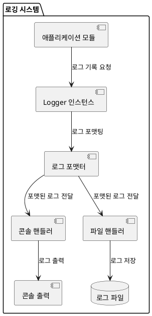
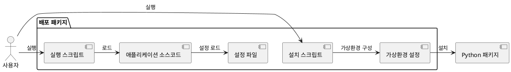

# RAG 기반 개인용 생성형 AI 챗봇 - 로깅 및 배포 설계

## 1. 로깅 시스템 설계

### 1.1 로깅 목표
로깅 시스템은 다음과 같은 목표를 가지고 설계되었습니다:
- 시스템의 동작 상태를 실시간으로 모니터링
- 오류 발생 시 원인 분석을 위한 정보 제공
- 성능 병목 지점 식별을 위한 데이터 수집
- 서버/클라이언트 간 통신 문제 파악
- 사용자 행동 패턴 분석

### 1.2 로깅 수준 정의

| 로그 레벨 | 용도 | 예시 |
|---------|------|------|
| DEBUG | 개발 및 디버깅용 상세 정보 | 함수 호출, 변수 값, 상세 처리 과정 |
| INFO | 일반적인 시스템 동작 정보 | 서버 시작/종료, 파일 업로드 완료, 질의 처리 |
| WARNING | 잠재적 문제 상황 | 지원되지 않는 파일 형식, 느린 응답 시간 |
| ERROR | 오류 상황 | 파일 처리 실패, API 연결 오류 |
| CRITICAL | 시스템 중단 수준의 심각한 오류 | 벡터 DB 손상, 서버 다운 |

### 1.3 로깅 구조



### 1.4 로깅 구현 방식

#### 1.4.1 로거 초기화
```python
import logging
import yaml
import os
from logging.config import dictConfig

def setup_logger(config_path="config/logging_config.yaml"):
    """로깅 시스템을 설정합니다."""
    if os.path.exists(config_path):
        with open(config_path, 'r', encoding='utf-8') as f:
            config = yaml.safe_load(f)
            dictConfig(config)
    else:
        # 기본 로깅 설정
        logging.basicConfig(
            level=logging.INFO,
            format='%(asctime)s - %(name)s - %(levelname)s - %(message)s',
            handlers=[
                logging.StreamHandler(),
                logging.FileHandler("logs/app.log", encoding="utf-8")
            ]
        )
    
    # 로그 디렉토리 생성
    os.makedirs("logs", exist_ok=True)
    
    return logging.getLogger("my_rag_chat")
```

#### 1.4.2 로깅 사용 예시
```python
# 모듈에서 로거 사용 예시
logger = logging.getLogger("my_rag_chat.document_processor")

def process_file(file_path):
    """파일을 처리하는 함수"""
    logger.info(f"파일 처리 시작: {file_path}")
    try:
        # 파일 처리 로직
        logger.debug(f"파일 크기: {os.path.getsize(file_path)} bytes")
        # ...
        logger.info(f"파일 처리 완료: {file_path}")
        return True
    except Exception as e:
        logger.error(f"파일 처리 중 오류 발생: {str(e)}", exc_info=True)
        return False
```

### 1.5 핵심 로깅 포인트

#### 1.5.1 문서 처리 모듈
- 파일 업로드 시작/완료
- 파일 파싱 과정
- 청킹 정보 (청크 수, 크기)
- 임베딩 처리 시간
- 벡터 저장 결과

#### 1.5.2 벡터 저장소 모듈
- 인덱스 생성/로드/저장
- 유사도 검색 쿼리 및 결과
- 인덱스 상태 변경

#### 1.5.3 RAG 엔진
- 질문 접수
- 컨텍스트 검색 결과
- 프롬프트 생성 정보

#### 1.5.4 LLM 연결 모듈
- API 요청 정보
- 응답 처리 시간
- 오류 및 재시도 정보

#### 1.5.5 프론트엔드 모듈
- 서버 시작/종료
- 요청 처리 정보
- 사용자 인터랙션 정보

### 1.6 로그 분석 및 활용

#### 1.6.1 로그 분석 방법
- 정기적인 로그 검토
- 오류 패턴 분석
- 성능 메트릭 추출

#### 1.6.2 로그 활용 사례
- 오류 디버깅 및 해결
- 성능 최적화
- 사용자 패턴 분석

## 2. 배포 설계

### 2.1 배포 목표
- 초보 개발자도 쉽게 설치하고 사용할 수 있는 배포 방식 제공
- Windows 환경에서 원활하게 실행되는 패키지 제공
- 의존성 관리 및 환경 설정 자동화
- 업데이트 및 유지보수 용이성 확보

### 2.2 배포 구조



### 2.3 설치 과정

#### 2.3.1 사전 요구사항
- Python 3.11.11
- Miniconda
- LM Studio (설치 및 실행)

#### 2.3.2 설치 스크립트 (install.bat)
```batch
@echo off
echo RAG 기반 개인용 생성형 AI 챗봇 설치를 시작합니다...

REM 가상환경 확인 및 생성
call conda --version > nul 2>&1
if %ERRORLEVEL% neq 0 (
    echo Miniconda가 설치되어 있지 않습니다. https://docs.conda.io/projects/miniconda/en/latest/ 에서 설치 후 다시 시도해주세요.
    exit /b 1
)

echo Miniconda 환경을 확인합니다...
call conda env list | findstr /C:"my_rag" > nul
if %ERRORLEVEL% neq 0 (
    echo my_rag 환경을 생성합니다...
    call conda create -n my_rag python=3.11.11 -y
    if %ERRORLEVEL% neq 0 (
        echo 가상환경 생성에 실패했습니다.
        exit /b 1
    )
) else (
    echo my_rag 환경이 이미 존재합니다.
)

REM 가상환경 활성화 및 패키지 설치
echo 가상환경을 활성화하고 필요한 패키지를 설치합니다...
call conda activate my_rag
if %ERRORLEVEL% neq 0 (
    echo 가상환경 활성화에 실패했습니다.
    exit /b 1
)

echo 필요한 패키지를 설치합니다...
call pip install -r requirements.txt
if %ERRORLEVEL% neq 0 (
    echo 패키지 설치에 실패했습니다.
    exit /b 1
)

REM 디렉토리 구조 생성
echo 필요한 디렉토리를 생성합니다...
if not exist "data\uploads" mkdir data\uploads
if not exist "data\vector_db" mkdir data\vector_db
if not exist "logs" mkdir logs

echo 설치가 완료되었습니다!
echo 실행 방법:
echo   1. run.bat 스크립트를 실행하여 애플리케이션을 시작하세요.
echo   2. 웹 브라우저에서 다음 주소로 접속하세요:
echo      - 파일 등록 대시보드: http://localhost:8050
echo      - 챗팅창: http://localhost:8000
```

#### 2.3.3 실행 스크립트 (run.bat)
```batch
@echo off
echo RAG 기반 개인용 생성형 AI 챗봇을 시작합니다...

REM 가상환경 활성화
call conda activate my_rag
if %ERRORLEVEL% neq 0 (
    echo 가상환경 활성화에 실패했습니다. install.bat를 먼저 실행해주세요.
    exit /b 1
)

REM LM Studio 실행 확인
echo LM Studio API 서비스 접근을 확인합니다...
curl -s http://localhost:1234/v1/models > nul
if %ERRORLEVEL% neq 0 (
    echo LM Studio API 서비스에 접근할 수 없습니다.
    echo LM Studio를 실행하고 API 서비스를 활성화한 후 다시 시도해주세요.
    exit /b 1
)

REM 애플리케이션 실행
echo 애플리케이션을 시작합니다...
start "RAG 챗봇 - 대시보드" python start_dashboard.py
start "RAG 챗봇 - 챗팅창" python start_chat.py

echo 실행 완료! 다음 주소로 접속하세요:
echo   - 파일 등록 대시보드: http://localhost:8050
echo   - 챗팅창: http://localhost:8000
```

### 2.4 설정 관리

#### 2.4.1 기본 설정 파일 (config.yaml)
- 시스템의 기본 설정을 정의한 YAML 파일
- 사용자가 필요에 따라 수정 가능

#### 2.4.2 설정 파일 로드 및 유효성 검사
```python
def load_config(config_path="config/config.yaml"):
    """설정 파일을 로드하고 유효성을 검사합니다."""
    try:
        with open(config_path, 'r', encoding='utf-8') as f:
            config = yaml.safe_load(f)
        
        # 필수 설정 항목 검사
        required_keys = [
            'app_name', 'dashboard.host', 'dashboard.port', 
            'chat.host', 'chat.port', 'file.upload_dir', 
            'embedding.model', 'vector_db.path', 'llm.api_base_url'
        ]
        
        for key in required_keys:
            parts = key.split('.')
            c = config
            for part in parts:
                if part not in c:
                    raise ValueError(f"필수 설정 항목이 누락되었습니다: {key}")
                c = c[part]
        
        return config
    except Exception as e:
        print(f"설정 파일 로드 중 오류 발생: {str(e)}")
        print("기본 설정을 사용합니다.")
        return get_default_config()
```

### 2.5 업데이트 및 유지보수

#### 2.5.1 업데이트 방식
- GitHub 레포지토리를 통한 소스 코드 업데이트
- 업데이트 스크립트 제공

#### 2.5.2 업데이트 스크립트 (update.bat)
```batch
@echo off
echo RAG 기반 개인용 생성형 AI 챗봇 업데이트를 시작합니다...

REM 백업 생성
echo 현재 설정을 백업합니다...
if not exist "backup" mkdir backup
xcopy /E /I /Y "config" "backup\config"

REM 최신 소스 코드 다운로드 (GitHub 사용 시)
echo 최신 코드를 다운로드합니다...
git pull

REM 패키지 업데이트
echo 패키지를 업데이트합니다...
call conda activate my_rag
call pip install -r requirements.txt --upgrade

REM 설정 병합
echo 설정을 업데이트합니다...
python scripts/merge_config.py backup/config/config.yaml config/config.yaml

echo 업데이트가 완료되었습니다!
```

### 2.6 문제 해결 가이드

#### 2.6.1 일반적인 문제 및 해결 방법
- 각종 오류 상황에 대한 진단 및 해결 방법 제공
- FAQ 형태로 문제 해결 가이드 제공

#### 2.6.2 진단 스크립트 (diagnose.bat)
```batch
@echo off
echo RAG 기반 개인용 생성형 AI 챗봇 진단을 시작합니다...

REM 환경 확인
echo 시스템 환경을 확인합니다...
echo Python 버전:
python --version

echo Conda 환경:
conda env list

REM 의존성 확인
echo 패키지 의존성을 확인합니다...
call conda activate my_rag
pip list

REM LM Studio 연결 확인
echo LM Studio API 연결을 확인합니다...
python scripts/check_llm.py

REM 로그 확인
echo 최근 로그를 확인합니다...
type logs\app.log | findstr /C:"ERROR" /C:"CRITICAL"

echo 진단이 완료되었습니다.
```

## 3. 사용자 가이드 작성

### 3.1 사용자 가이드 목적
- 초보 개발자도 쉽게 이해하고 사용할 수 있도록 안내
- 시스템의 주요 기능 및 사용 방법 설명
- 문제 해결 및 최적 사용 방법 안내

### 3.2 사용자 가이드 구성

#### 3.2.1 설치 및 시작 가이드
- 사전 요구사항 안내
- 설치 과정 상세 설명
- 시스템 시작 및 종료 방법

#### 3.2.2 기능별 사용 가이드
- 파일 등록 대시보드 사용법
- 채팅창 사용법
- 문서 관리 방법

#### 3.2.3 최적화 및 문제 해결 가이드
- 성능 최적화 팁
- 일반적인 문제 해결 방법
- 고급 설정 옵션 안내

### 3.3 사용자 가이드 형식
- 마크다운 문서로 제공
- 스크린샷 및 예시 포함
- 단계별 지침 제공

## 4. 보안 고려사항

### 4.1 데이터 보안
- 모든 데이터는 로컬에서만 처리 및 저장
- 민감한 정보는 설정 파일에서 분리하여 관리

### 4.2 API 키 관리
- LM Studio API 키 보안 관리 방법
- 환경 변수 활용

### 4.3 파일 접근 제한
- 업로드 디렉토리 접근 제한
- 안전한 파일 처리
